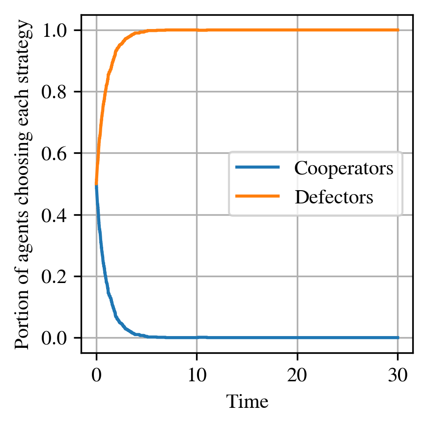

Prisoner's Dilemma
==================

This example models a population of agents repeatedly choosing between two strategies:
**cooperate** or **defect**, as in the classic Prisoner's Dilemma game.

It demonstrates how revision dynamics can drive the population toward defection,
even when mutual cooperation would be socially optimal.

.. literalinclude:: ../../examples/prisoners_dilemma.py
   :language: python
   :linenos:

